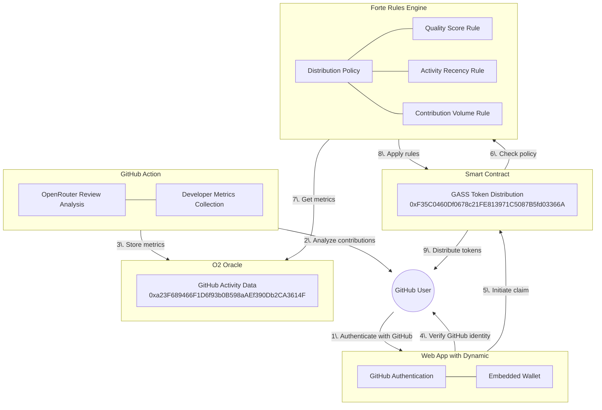

# GASS System Architecture

GASS connects three components to create a fair, transparent, Sybil-resistant token distribution system.

## Components

1. **GitHub Action** (this repo) — analyzes PRs with OpenRouter and stores developer metrics in the O2 Oracle
2. **Smart Contract + Forte Rules Engine** — applies on-chain distribution policies based on those metrics ([`0xF35C0460Df0678c21FE813971C5087B5fd03366A`](https://sepolia.basescan.org/address/0xF35C0460Df0678c21FE813971C5087B5fd03366A) on Base Sepolia)
3. **Web App with Dynamic** — verifies GitHub identity and lets users claim tokens ([web-wallet-demo](../../web-wallet-demo/))

## Flow Diagram

## Distribution Tiers

The Forte Rules Engine evaluates three on-chain metrics and assigns a tier on each claim:

| Tier | Criteria | Token Allocation |
|------|----------|-----------------|
| Rejected | Quality score ≤ 50 | Transaction reverts |
| Limited | Score > 50, activity not recent | 50% |
| Standard | Score > 50, recent activity, normal volume | 100% |
| Bonus | Score > 50, recent activity, high volume | 200% |

## Production Deployment (Base Sepolia)

| Component | Address |
|-----------|---------|
| GASS Contract | `0xF35C0460Df0678c21FE813971C5087B5fd03366A` |
| GASS Token | `0x777E1Ad0Cfb52abbF5A5F70dB4382CC166d8DFf7` |
| O2 Oracle | `0xa23F689466F1D6f93b0B598aAEf390Db2CA3614F` |
| Forte Rules Engine | `0x6189A916E3f190Bf3cE6247b7A0dE862d1De8387` |

## GitHub Verification

Two approaches are implemented for verifying the user claiming tokens is the legitimate GitHub account owner:

1. **JWT-Based** (recommended) — user authenticates with GitHub through Dynamic; the backend verifies the JWT with Dynamic's API and the contract accepts the trusted backend's signature
2. **Signature-Based** — user signs a message containing their GitHub username and wallet address; the contract verifies the signature on-chain

## Web App Screenshots

## Demo Video

https://github.com/michael-bey/gass/raw/main/images/gass-demo-video.mp4
