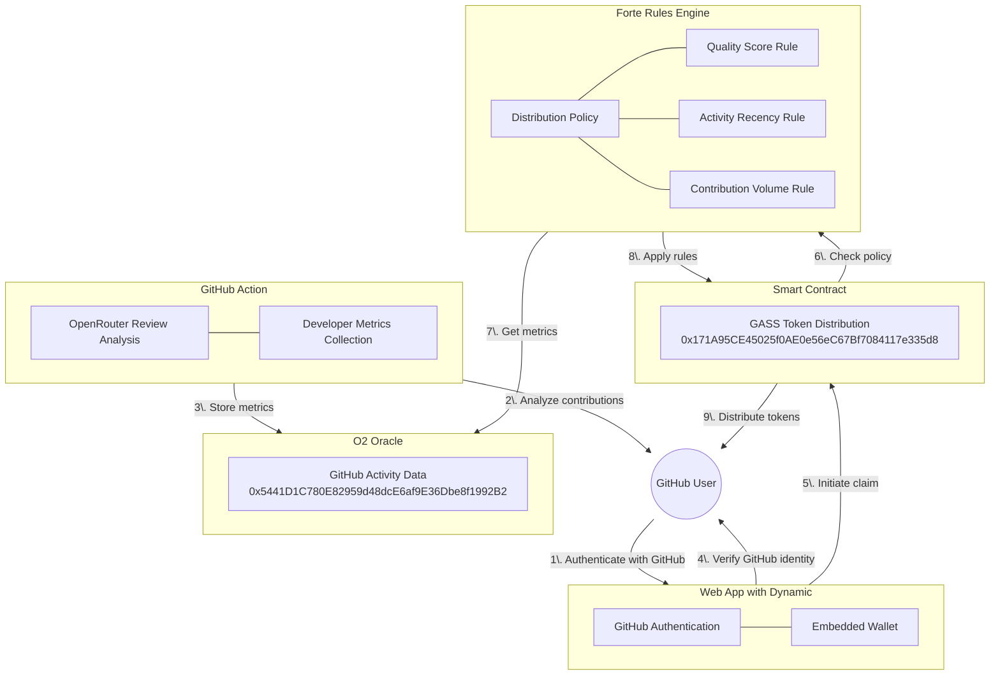
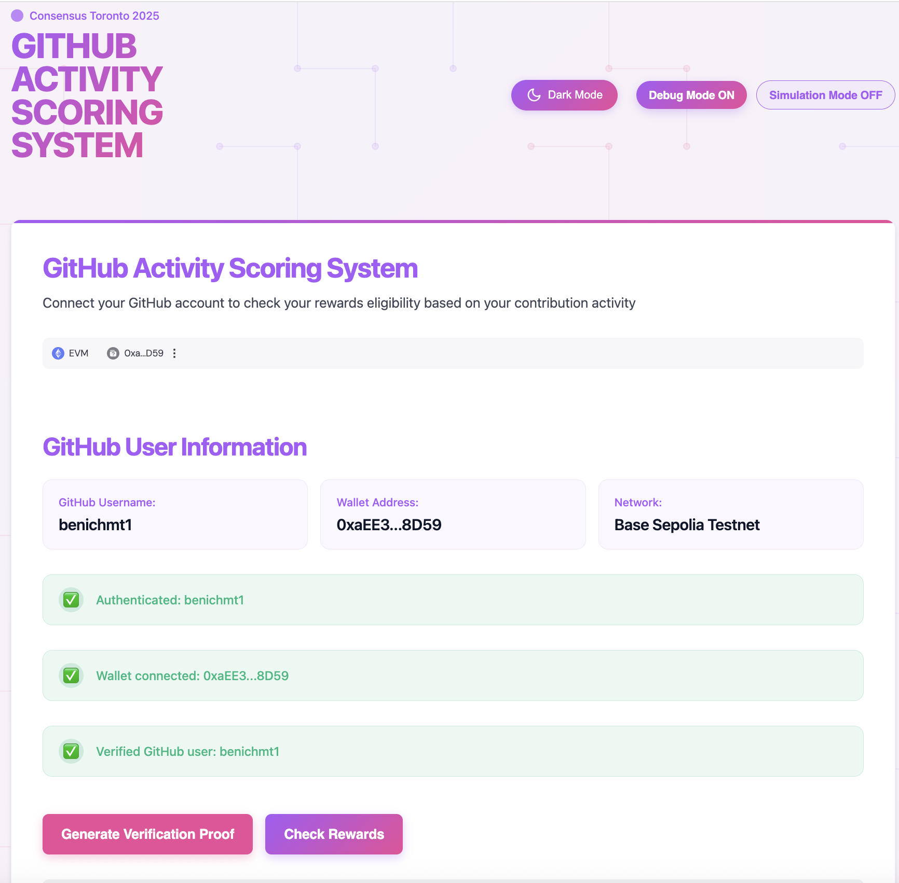
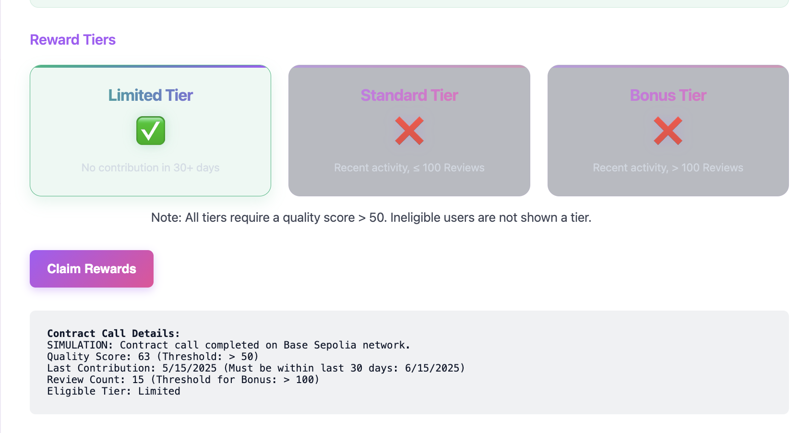

# GASS - Github Activity Scoring System

A proof of concept designed to improve the airdrop claim experience by connecting GitHub contributions to token distribution. GASS provides a fair, transparent, and verifiable system for rewarding developers based on their actual contributions.

## Problem Statement

Traditional airdrops lack transparency, are vulnerable to Sybil attacks, and don't reward actual contributions. GASS solves these issues by connecting GitHub activity metrics to token distribution through a three-part system.

## System Components

GASS connects three key components to create a fair and transparent token distribution system:

1. **GitHub Action with OpenRouter**: Analyzes code reviews and pushes metrics to the O2 Oracle for tracking developers' projects and contributions.
   - [GitHub Action Workflow](/.github/workflows/push_quality_score.yml) and [Scripts](/.github/scripts/)
   - Deployed at `0x5441D1C780E82959d48dcE6af9E36Dbe8f1992B2` on Base Sepolia
   - Tracks quality scores, activity timestamps, and contribution volume
   - Automatically runs on pull request events (open, sync, reopen)

2. **Smart Contract with Forte Rules Engine**: Applies token allocation policies based on the metrics from the O2 Oracle.
   - [Smart Contracts](/src/) and [Deployment Scripts](/script/)
   - [Distribution Policy](/o2_oracle_policy.json)
   - Deployed at `0x171A95CE45025f0AE0e56eC67Bf7084117e335d8` on Base Sepolia
   - Uses policy rules to determine appropriate token distribution tiers

3. **Web App with Dynamic Authentication**: Verifies that users claiming rewards are the authorized GitHub users, with built-in wallet functionality.
   - [Web Wallet Demo](/web-wallet-demo/)
   - Provides seamless GitHub verification and wallet integration
   - Ensures only legitimate GitHub users can claim their tokens

### System Architecture

## How It Works

1. **GitHub Activity Analysis**: The GitHub Action uses OpenRouter to analyze code reviews and contributions, then pushes metrics to the O2 Oracle:
   - Triggered automatically on pull requests
   - Uses Claude 3 Opus via OpenRouter API to perform code quality analysis
   - Calculates a quality score (0-100) based on code review
   - Tracks metrics like last activity timestamp and contribution count
   - Stores all data in the O2 Oracle for on-chain access

2. **Token Distribution Rules**: The Forte Rules Engine applies the following distribution tiers based on developer metrics:
   - **Rejected**: Quality score ≤ 50 (transaction reverts)
   - **Limited**: Quality score > 50, but activity not recent (half tokens)
   - **Bonus**: Quality score > 50, recent activity, high contribution volume (double tokens)
   - **Standard**: Quality score > 50, recent activity, normal contribution volume (standard amount)

3. **Verified Claims**: The web app uses Dynamic to verify GitHub identity and provide wallet functionality:
   - Users authenticate with GitHub through Dynamic
   - The app verifies the user is the legitimate GitHub account owner
   - Users can check their rewards eligibility with visual indicators for each tier
   - The interface displays detailed contract call information including quality score, last contribution date, and review count
   - Users can claim tokens directly through the integrated wallet with a single click

## Key Benefits

1. **Meritocratic Distribution**: Tokens are allocated based on actual contributions
2. **Sybil Resistance**: Distribution requires verified GitHub accounts and real activity
3. **Transparent Rules**: All distribution criteria are publicly visible on-chain
4. **Flexible Policies**: Distribution rules can be updated without changing contract code
5. **Seamless Experience**: Integrated verification and wallet functionality

## Technical Implementation

### GitHub Action

The GitHub Action workflow (`push_quality_score.yml`) runs automatically on pull request events:

1. **Code Analysis Process**:
   - Extracts the PR diff for analysis
   - Sends the diff to OpenRouter with a comprehensive code review prompt
   - Uses Claude 3 Opus to evaluate code quality, readability, potential issues, documentation, and best practices
   - Extracts a numerical score (0-100) from the AI's assessment

2. **O2 Oracle Integration**:
   - Authenticates with the O2 Oracle API
   - Checks if the GitHub user already exists in the database
   - For existing users: calculates a weighted average score based on previous contributions
   - For new users: creates a new entry with the initial score
   - Updates metrics including quality score, last activity timestamp, and contribution count
   - Publishes changes to make them available on-chain

### Smart Contract

The GASS contract is deployed at `0x171A95CE45025f0AE0e56eC67Bf7084117e335d8` on Base Sepolia with Policy ID `69`. It uses the Forte Rules Engine to apply distribution rules based on O2 Oracle data.

### O2 Oracle

The O2 Oracle at `0x5441D1C780E82959d48dcE6af9E36Dbe8f1992B2` stores developer metrics:
- Quality scores (code quality assessment)
- Last updated timestamps (recency of activity)
- Review counts (contribution volume)

### Web App with Dynamic

The web app uses Dynamic for GitHub authentication and wallet functionality:
- Verifies GitHub identity through OAuth
- Provides embedded wallet functionality
- Connects to Base Sepolia network
- Interacts with the GASS contract for token claims
- Features a clean UI with dark/light mode toggle
- Shows visual indicators for reward tier eligibility
- Displays detailed contract call information

## GitHub Verification

We've implemented two approaches for GitHub verification:

1. **JWT-Based Verification** (Recommended): Uses Dynamic's JWT verification system
   - User authenticates with GitHub through Dynamic
   - Backend verifies JWT token with Dynamic's API
   - Contract accepts verification from trusted backend

2. **Signature-Based Verification**: Uses on-chain signature verification
   - User signs a message containing GitHub username and wallet address
   - Contract verifies the signature matches the claiming wallet

## Sample Data

The O2 Oracle contains the following developer metrics:

| GitHub Username | Quality Score | Last Updated | Review Count | Expected Distribution Tier |
|-----------------|--------------|--------------|-------------|---------------------------|
| benichmt1       | 63           | 1747331744   | 25          | Limited (50% allocation) |

## Use Cases

This proof of concept can be extended for:
- Token airdrops based on community contributions
- Retroactive funding for open source developers
- DAO governance token distribution
- Community rewards programs
- Contributor reputation systems

## Web App Interface

The GASS web application provides a clean, intuitive interface for users to connect their GitHub accounts and check their rewards eligibility. The UI features a modern design with both dark and light mode options, debug and simulation mode toggles, and clear visual indicators for verification status.

After connecting, users can see their eligibility for different reward tiers based on their GitHub activity metrics. Each tier displays a green checkmark for eligible tiers or a red X for ineligible tiers, along with the specific criteria for each tier. The interface also shows detailed contract call information including quality score, last contribution date, and review count.

### Demo Video

Watch a demonstration of the GASS application in action. The video shows the complete user journey from connecting a wallet and authenticating with GitHub to checking rewards eligibility and claiming tokens. It demonstrates how the system verifies GitHub identity, retrieves metrics from the O2 Oracle, applies the distribution policy rules, and processes the reward claim:

https://github.com/benichmt1/gass/raw/main/images/gass-demo-video.mp4

## Production Deployment

The GASS system is deployed on Base Sepolia testnet:
- **Smart Contract**: `0x171A95CE45025f0AE0e56eC67Bf7084117e335d8`
- **O2 Oracle**: `0x5441D1C780E82959d48dcE6af9E36Dbe8f1992B2`
- **Forte Rules Engine**: `0x4E448907B4B8d5949D4A6C67f34419dBb29690bD`
- **Block Explorer**: [View on BaseScan](https://sepolia.basescan.org/address/0x171A95CE45025f0AE0e56eC67Bf7084117e335d8)
