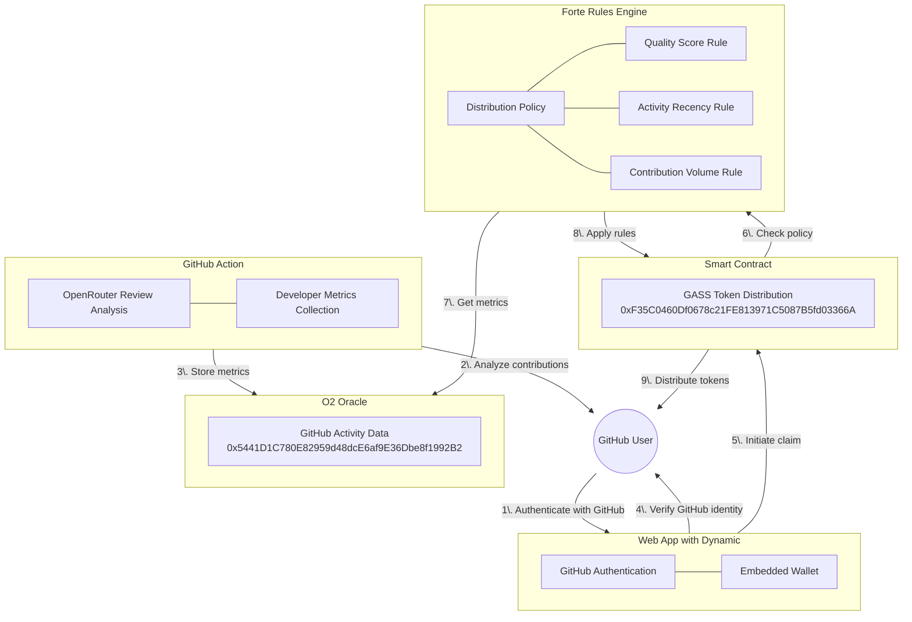

# GASS - Github Activity Scoring System

Automatically scores pull request code quality using AI and stores the results on-chain via the [O2 Oracle](https://o2-oracle.io). Scores are used to determine token distribution tiers in the GASS system — but the action works standalone in any repo that wants on-chain developer metrics.

## Quick Start

Add this to `.github/workflows/gass.yml` in your repository:

```yaml
name: GASS Analysis
on:
  pull_request:
    types: [opened, synchronize, reopened]

jobs:
  analyze:
    runs-on: ubuntu-latest
    steps:
      - uses: actions/checkout@v4

      - name: GASS Code Quality Score
        uses: michael-bey/gass@v1
        with:
          o2_email: ${{ secrets.O2_EMAIL }}
          o2_password: ${{ secrets.O2_PASSWORD }}
          o2_app_id: ${{ secrets.O2_APP_ID }}
          o2_prop_list_id: ${{ secrets.O2_PROP_LIST_ID }}
          openrouter_api_key: ${{ secrets.OPENROUTER_API_KEY }}
```

On every pull request, the action will:
1. Fetch the PR diff
2. Send it to OpenRouter (claude-opus-4.5 by default) for code quality analysis
3. Calculate a score from 0–100
4. Create or update the contributor's record in the O2 Oracle with their score, review count, and timestamp

## Inputs

| Input | Required | Default | Description |
|-------|----------|---------|-------------|
| `o2_email` | Yes | — | O2 Oracle account email |
| `o2_password` | Yes | — | O2 Oracle account password |
| `o2_app_id` | Yes | — | O2 Oracle app ID (see below) |
| `o2_prop_list_id` | Yes | — | O2 Oracle property list ID (see below) |
| `openrouter_api_key` | Yes | — | OpenRouter API key |
| `openrouter_model` | No | `anthropic/claude-opus-4.5` | Model to use for code review |

## Finding Your O2 Oracle Credentials

You'll need an [O2 Oracle](https://o2-oracle.io) account with an app and property list set up.

**`O2_EMAIL` / `O2_PASSWORD`** — Your O2 Oracle login credentials.

**`O2_APP_ID`** — The ID of your app in O2 Oracle. Note: this is *not* your organization ID — they look similar but are different. To find it:

```bash
npm install node-fetch
node -e "
const fetch = require('node-fetch');
(async () => {
  const r = await fetch('https://sandbox.api.o2-oracle.io/login', {
    method: 'POST',
    headers: {'Content-Type': 'application/json'},
    body: JSON.stringify({email: 'YOUR_EMAIL', password: 'YOUR_PASSWORD'})
  });
  const {token} = await r.json();
  const apps = await fetch('https://sandbox.api.o2-oracle.io/apps', {
    headers: {Authorization: 'Bearer ' + token}
  });
  console.log(JSON.stringify(await apps.json(), null, 2));
})();
"
```

Each app in the response has an `id` field — that's your `O2_APP_ID`.

**`O2_PROP_LIST_ID`** — The ID of the property list within your app that will store developer scores. Once you have your `O2_APP_ID`, run the included helper script from a clone of this repo:

```bash
O2_EMAIL=your@email.com O2_PASSWORD=yourpassword O2_APP_ID=your-app-id \
  node .github/scripts/get_property_lists.js
```

Find your property list in the output — its `id` field is your `O2_PROP_LIST_ID`.

## Score Tiers

Once scores are on-chain, the GASS smart contract uses the Forte Rules Engine to apply distribution rules:

| Tier | Criteria | Token Allocation |
|------|----------|-----------------|
| Rejected | Quality score ≤ 50 | Transaction reverts |
| Limited | Score > 50, activity not recent | 50% |
| Standard | Score > 50, recent activity, normal volume | 100% |
| Bonus | Score > 50, recent activity, high volume | 200% |

---

## About GASS

GASS is a proof of concept for meritocratic, Sybil-resistant token distribution. It connects three components:

1. **This GitHub Action** — analyzes PRs with OpenRouter and stores metrics in the O2 Oracle
2. **Smart Contract + Forte Rules Engine** — applies distribution policies based on on-chain metrics ([deployed at `0xF35C0460Df0678c21FE813971C5087B5fd03366A`](https://sepolia.basescan.org/address/0xF35C0460Df0678c21FE813971C5087B5fd03366A) on Base Sepolia)
3. **Web App with Dynamic** — verifies GitHub identity and lets users claim tokens ([web-wallet-demo](/web-wallet-demo/))

### System Architecture


```mermaid
flowchart TD
    User((GitHub User))

    subgraph WebApp["Web App with Dynamic"]
        DynamicAuth["GitHub Authentication"]
        WalletIntegration["Embedded Wallet"]
    end

    subgraph GitHubAction["GitHub Action"]
        OpenRouter["OpenRouter Review Analysis"]
        MetricsCollection["Developer Metrics Collection"]
    end

    subgraph GASS["Smart Contract"]
        GASSContract["GASS Token Distribution<br/>0xF35C0460Df0678c21FE813971C5087B5fd03366A"]
    end

    subgraph FRE["Forte Rules Engine"]
        Policy["Distribution Policy"]
        Rule1["Quality Score Rule"]
        Rule2["Activity Recency Rule"]
        Rule3["Contribution Volume Rule"]
    end

    subgraph Oracle["O2 Oracle"]
        O2Contract["GitHub Activity Data<br/>0x5441D1C780E82959d48dcE6af9E36Dbe8f1992B2"]
    end

    User -->|"1\. Authenticate with GitHub"| WebApp
    GitHubAction -->|"2\. Analyze contributions"| User
    GitHubAction -->|"3\. Store metrics"| Oracle
    WebApp -->|"4\. Verify GitHub identity"| User
    WebApp -->|"5\. Initiate claim"| GASS
    GASS -->|"6\. Check policy"| FRE
    FRE -->|"7\. Get metrics"| Oracle
    FRE -->|"8\. Apply rules"| GASS
    GASS -->|"9\. Distribute tokens"| User

    Policy --- Rule1
    Policy --- Rule2
    Policy --- Rule3
    DynamicAuth --- WalletIntegration
    OpenRouter --- MetricsCollection
```

### Production Deployment (Base Sepolia)

| Component | Address |
|-----------|---------|
| GASS Contract | `0xF35C0460Df0678c21FE813971C5087B5fd03366A` |
| GASS Token | `0x777E1Ad0Cfb52abbF5A5F70dB4382CC166d8DFf7` |
| O2 Oracle | `0x5441D1C780E82959d48dcE6af9E36Dbe8f1992B2` |
| Forte Rules Engine | `0x6189A916E3f190Bf3cE6247b7A0dE862d1De8387` |

### Web App Interface


### Demo Video

https://github.com/michael-bey/gass/raw/main/images/gass-demo-video.mp4

### Use Cases

- Token airdrops based on community contributions
- Retroactive funding for open source developers
- DAO governance token distribution
- Community rewards programs
- Contributor reputation systems
